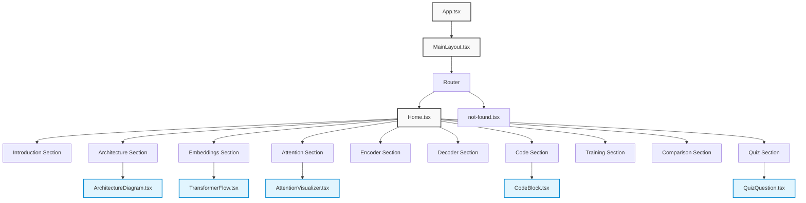

# Application File Layout

This document provides an overview of the file structure of the Transformer Models Educational Web Application, explaining the organization and purpose of each major directory and file.

## Directory Structure

```
project-root/
├── client/                 # Client-side code
│   ├── index.html          # HTML entry point
│   └── src/                # React source code
│       ├── components/     # Reusable UI components
│       ├── contexts/       # React context providers
│       ├── hooks/          # Custom React hooks
│       ├── layouts/        # Page layout components
│       ├── lib/            # Utility functions and services
│       ├── pages/          # Page components
│       ├── App.tsx         # Main application component
│       ├── index.css       # Global CSS
│       └── main.tsx        # Application entry point
│
├── server/                 # Server-side code
│   ├── index.ts            # Server entry point
│   ├── routes.ts           # API route definitions
│   ├── storage.ts          # Data storage implementation
│   └── vite.ts             # Vite server configuration
│
├── shared/                 # Shared code between client and server
│   └── schema.ts           # Data model definitions
│
├── docs/                   # Documentation
│   ├── architecture/       # System architecture documentation
│   ├── components/         # Component documentation
│   └── lifecycle/          # Application lifecycle documentation
│
└── config files            # Various configuration files
    ├── tsconfig.json       # TypeScript configuration
    ├── vite.config.ts      # Vite configuration
    ├── tailwind.config.ts  # Tailwind CSS configuration
    └── components.json     # shadcn/ui components configuration
```

## Key Files Explained

### Client

#### Entry Points

- `client/index.html`: The HTML entry point for the application
- `client/src/main.tsx`: The JavaScript entry point that bootstraps the React application
- `client/src/App.tsx`: The root React component that sets up routing

#### Core Directories

- `client/src/components/`: Contains all reusable UI components
  - `ui/`: shadcn UI component library
  - Custom components: `ArchitectureDiagram.tsx`, `AttentionVisualizer.tsx`, `CodeBlock.tsx`, etc.

- `client/src/contexts/`: Contains React context providers
  - `ScrollSpyContext.tsx`: Manages the active section for navigation

- `client/src/hooks/`: Contains custom React hooks
  - `use-scroll-spy.ts`: Hook for tracking scroll position (legacy)
  - `use-mobile.tsx`: Hook for detecting mobile devices
  - `use-toast.ts`: Hook for displaying toast notifications

- `client/src/layouts/`: Contains layout components
  - `MainLayout.tsx`: Main application layout with sidebar

- `client/src/pages/`: Contains page components
  - `Home.tsx`: Main content page with all educational sections
  - `not-found.tsx`: 404 page for handling invalid routes

- `client/src/lib/`: Contains utility functions
  - `utils.ts`: General utility functions
  - `queryClient.ts`: React Query client configuration
  - `mathjax-config.ts`: MathJax configuration for mathematical notation

### Server

- `server/index.ts`: Express server setup and initialization
- `server/routes.ts`: API route definitions for content endpoints
- `server/storage.ts`: In-memory data storage implementation
- `server/vite.ts`: Vite server configuration for development

### Shared

- `shared/schema.ts`: Data model definitions using Drizzle ORM and Zod validation

## Component Hierarchy



## Data Model

The application uses the following main data models:

### User

Represents a user of the application (for future authentication).

Properties:
- `id`: Unique identifier
- `username`: User's username
- `password`: Hashed password

### Section

Represents an educational section in the application.

Properties:
- `id`: Unique identifier
- `slug`: URL-friendly identifier
- `title`: Section title
- `content`: Section content
- `order`: Display order

### QuizQuestion

Represents a quiz question for testing knowledge.

Properties:
- `id`: Unique identifier
- `question`: Question text
- `options`: Answer options
- `correctOption`: Correct answer identifier
- `explanation`: Explanation of the correct answer

### UserProgress

Tracks a user's progress through the educational content.

Properties:
- `id`: Unique identifier
- `userId`: Reference to a user
- `completedSections`: Sections the user has completed
- `quizScores`: User's scores on quizzes