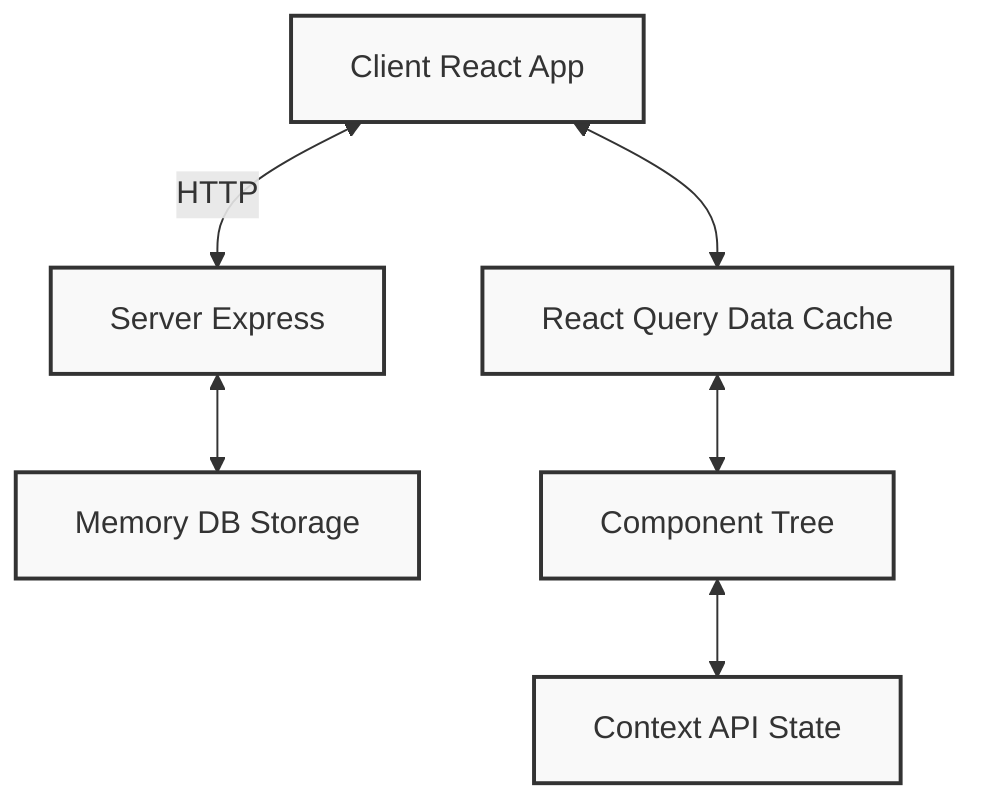

# Application Lifecycle

This document describes the lifecycle of the Transformer Models Educational Web Application, detailing how data flows through the system and how components interact with each other.

## Initialization Flow

### 1. Application Bootstrap

- `main.tsx` initializes the React application
- Wraps the application with necessary providers:
  - `QueryClientProvider` for data fetching
  - `ThemeProvider` for theme management
  - `ScrollSpyProvider` for navigation tracking
- Renders the main `App` component

### 2. Routing Setup

- `App.tsx` sets up routing using `wouter`
- Defines routes for the main pages and 404 handling
- Wraps everything in the `MainLayout` component

### 3. Layout Initialization

- `MainLayout.tsx` creates the application shell
- Sidebar navigation is set up with links to all sections
- Uses `useScrollSpyContext` to track active section

### 4. Content Loading

- `Home.tsx` fetches content from the server using React Query
- API request to `/api/content` retrieves all educational content
- Content is stored in memory database on the server

## Navigation Lifecycle

### 1. User Scrolling

- As user scrolls, `IntersectionObserver` in `Home.tsx` monitors which sections are visible
- When a section becomes visible, `setActiveSection` is called with the section ID
- The active section is stored in `ScrollSpyContext`

### 2. URL Synchronization

- When active section changes, URL hash is updated using `window.history.replaceState`
- This allows for sharing direct links to specific sections

### 3. Sidebar Highlighting

- Sidebar navigation items read the active section from `ScrollSpyContext`
- The active item is highlighted to show current position in the content

## Interactive Components Lifecycle

### 1. Code Blocks

- `CodeBlock` component renders syntax-highlighted code samples
- Uses tabs for organizing multiple code examples
- Renders using `react-syntax-highlighter`

### 2. Quiz Questions

- `QuizQuestion` component manages state for each quiz question
- Tracks selected answers and shows feedback
- Explanation is shown after an answer is selected

### 3. Visualizations

- `AttentionVisualizer` demonstrates attention mechanism
- `TransformerFlow` shows data flow through transformer architecture
- `ArchitectureDiagram` presents overall model structure

## Data Flow

## Error Handling

### 1. API Request Errors

- React Query handles retries and error states for API requests
- Error boundaries catch and display rendering errors

### 2. Navigation Errors

- 404 page handles invalid routes
- Fallback to introduction section if invalid hash is provided

## Performance Considerations

### 1. Code Splitting

- Large components could be lazy-loaded
- Visualizations render only when in viewport

### 2. Caching

- API responses are cached by React Query
- Educational content rarely changes, so caching is effective